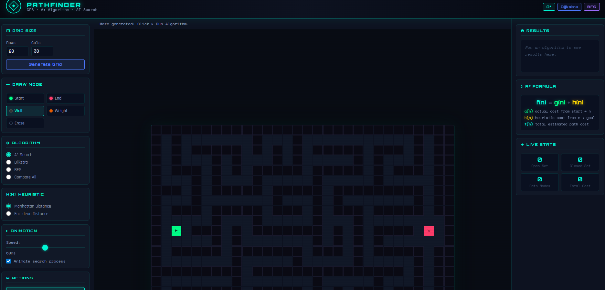
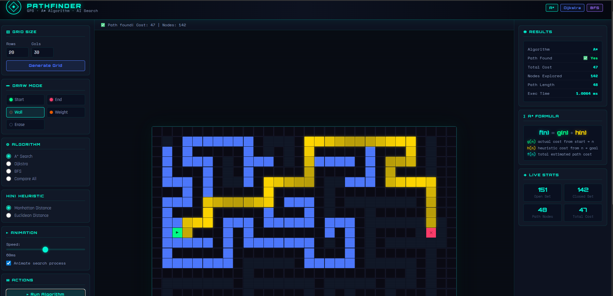
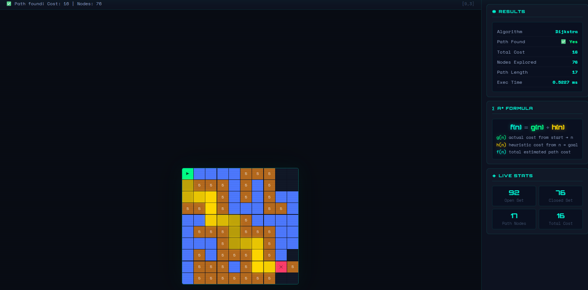
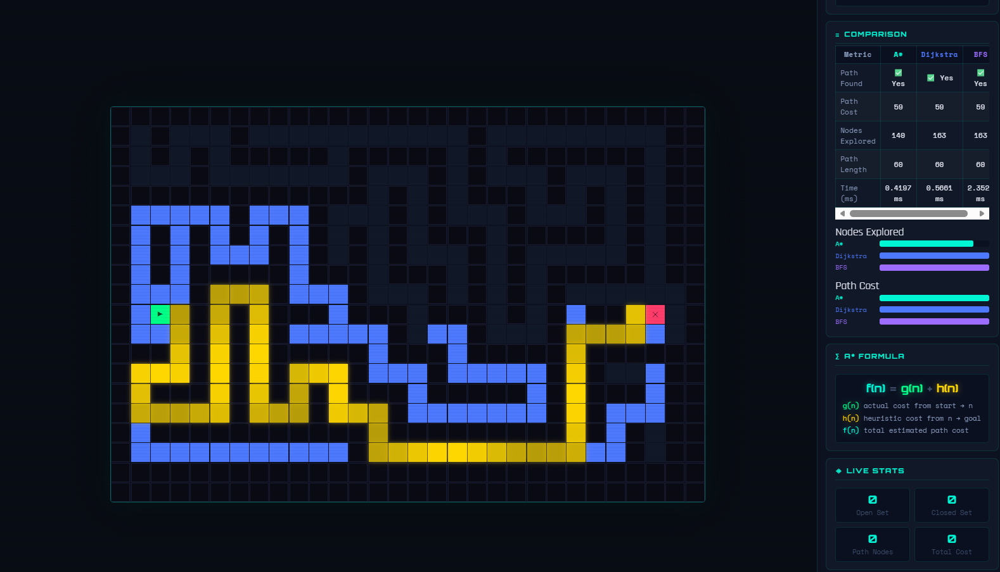

# 🚀 GPS-Based City Route Finder using A* Algorithm  
### *(Artificial Intelligence Problem Solving Project)*

---

## 📌 Objective

The objective of this project is to apply Artificial Intelligence problem-solving techniques to find the most optimal route between two locations in a city using search algorithms. The system simulates a GPS-based navigation system with intelligent pathfinding capabilities.

---

## 🧠 Problem Description

This project focuses on designing a GPS-based navigation system that determines the most efficient route between two locations in a city. The city is modeled as a weighted graph or grid, where each node represents a location and each edge represents a path with an associated travel cost such as distance or time. Some paths may be blocked due to obstacles like traffic or construction.

The syste allows users to interactively select a start location and a destination through a graphical interface. Using the A* (A-star) search algorithm, the system computes the optimal route by considering both the actual cost from the start node and a heuristic estimate of the remaining distance to the goal.

The solution ensures that a valid and optimal path is found whenever one exists. The final output displays the computed route, the total travel cost, and the number of nodes explored during the search process.

---

## 🗺️ Graph Representation

The city is represented as a 2D weighted grid:

- Each cell represents a node (location)
- Movement between cells represents edges (paths)
- Each edge has an associated cost

### Grid Values:

| Value | Meaning |
|------|--------|
| 0 | Normal road (cost = 1) |
| -1 | Obstacle / Wall (blocked) |
| 2-9 | Traffic zones (higher cost) |

### Movement:
- Allowed in four directions: Up, Down, Left, Right

---

## ⚙️ Algorithms Used

### 🔹 A* Search Algorithm (Primary)

A* is a heuristic-based algorithm that guarantees the optimal path.

Formula: f(n) = g(n) + h(n)

Where:
- g(n) = actual cost from start to node n  
- h(n) = heuristic estimate from node n to goal  
- f(n) = total estimated cost  

---

### 🔹 Dijkstra’s Algorithm

- Special case of A* where h(n) = 0  
- Explores all possible paths  
- Guarantees optimal solution  
- Slower compared to A*  

---

### 🔹 Breadth-First Search (BFS)

- Uses FIFO queue  
- Finds shortest path in terms of steps  
- Does not consider weights, so may not give optimal cost  

---

## 📏 Heuristic Functions

### ✅ Manhattan Distance
|x1 - x2| + |y1 - y2|

- Best suited for grid movement without diagonals  

### ✅ Euclidean Distance
√((x1 - x2)^2 + (y1 - y2)^2)

- More realistic distance calculation  

---

## 📊 Algorithm Comparison

| Feature | A* | Dijkstra | BFS |
|--------|----|----------|-----|
| Optimal Path | Yes | Yes | No (for weighted graphs) |
| Uses Heuristic | Yes | No | No |
| Speed | Fastest | Medium | Fast but inaccurate |
| Nodes Explored | Least | More | Most |

---

## 🎮 Features

- Interactive grid-based UI  
- Set Start (Green) and End (Red) nodes  
- Draw obstacles (walls)  
- Add traffic weights  
- Run A*, Dijkstra, BFS  
- Algorithm comparison mode  
- Step-by-step visualization  
- Animation speed control  
- Heuristic selection (Manhattan / Euclidean)  
- Displays:
  - Optimal path  
  - Total cost  
  - Nodes explored  
  - Execution time  

---

## ▶️ Execution Steps

1. Clone the repository  
   git clone <https://github.com/subhashreec1013-spec/AI_ProblemSolving_RA2411026050241>  
     
   cd AI_ProblemSolving_<RA2411026050241>  

2. Install dependencies  
   pip install -r requirements.txt  

3. Run the application  
   python app.py  

4. Open browser  
   http://localhost:5000  

---

## 🧪 Sample Input

Grid:
[
 [0, 0, 0],
 [0, -1, 0],
 [0, 0, 0]
]

Start: (0,0)  
Goal: (2,2)  

---

## 📤 Sample Output

Algorithm: A*  

Path:  
(0,0) → (1,0) → (2,0) → (2,1) → (2,2)  

Total Cost: 4  
Nodes Explored: 7  
Execution Time: ~0.05 ms  

---

## 🌐 API Endpoints

| Endpoint | Method | Description |
|--------|--------|------------|
| /astar | POST | Run A* Algorithm |
| /dijkstra | POST | Run Dijkstra |
| /bfs | POST | Run BFS |

Example Request:
{
  "grid": [[0,0,0],[0,-1,0],[0,0,0]],
  "start": [0,0],
  "goal": [2,2],
  "heuristic": "manhattan"
}

---

## 📁 Project Structure

AI_ProblemSolving_<RA2411026050241>/
│
├── app.py  
├── algorithms/  
│   ├── astar.py  
│   ├── dijkstra.py  
│   ├── bfs.py  
│
├── templates/  
│   └── index.html  
│
├── static/  
│   ├── style.css  
│   ├── script.js  
│
├── README.md  
├── requirements.txt 
 

---
## Live Demo
Click below to open the deployed application:
https://route-finder-bkpi.onrender.com

## Screenshots

### 🔹 Initial UI

### 🔹 A* Path Result

### 🔹 Weighted Traffic Routing

### 🔹 Algorithm Comparison

---

## Author

Name: Subha Shree C 
Register Number: RA2411026050241 

---

## Conclusion

This project demonstrates the application of AI search algorithms in solving real-world navigation problems. Among all algorithms, A* provides the best performance by combining actual cost and heuristic estimation, making it highly efficient for GPS-based systems.

---
